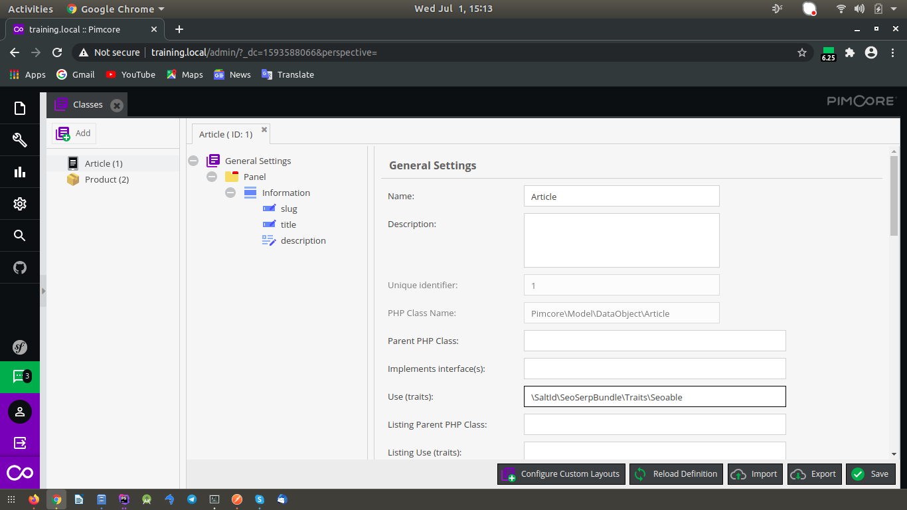
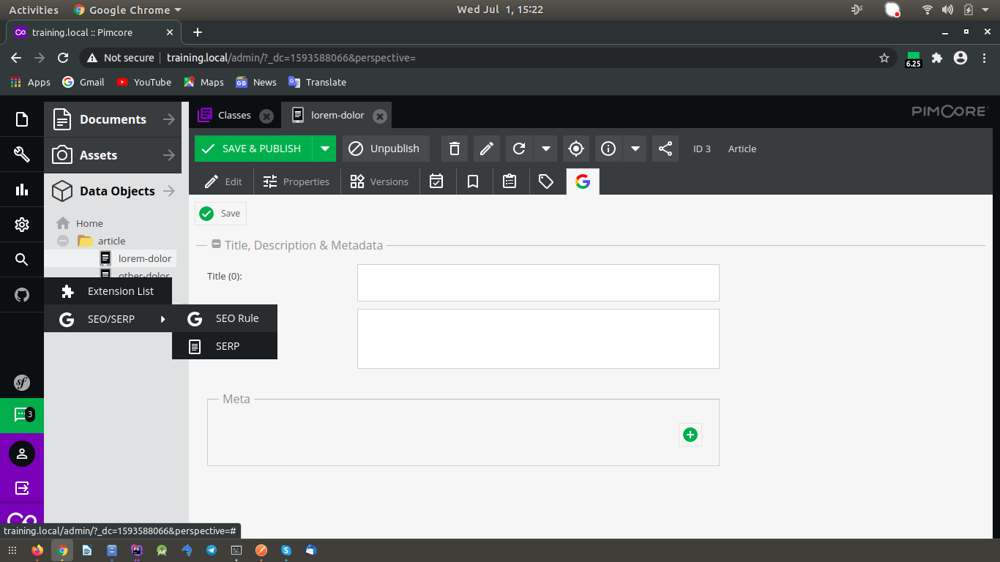

# SEO/SERP Pimcore

SEO/SERP Pimcore

## Integration into Pimcore

### Installation and Configuration

```bash
# COMPOSER_MEMORY_LIMIT=-1 composer -vvv require saltid/pimcore-seoserpbundle ~1.0@beta
```

Enable bundle via admin or cli after installation, since this bundle is required other bundle (Extension Manager) we need to enable it first

Via Admin Mode :


*Don't forget to clear cache and reload.

Via CLI :

```bash
# php bin/console pimcore:bundle:list
```

| Bundle                          	| Enabled 	| Installed 	| Installable 	| Uninstallable 	| Updatable 	| Priority 	|
|---------------------------------	|---------	|-----------	|-------------	|---------------	|-----------	|----------	|
| PimcoreEcommerceFrameworkBundle 	|    ❌    	|     ❌     	|      ❌      	|       ❌       	|     ❌     	|     0    	|
| ExtensionManagerBundle          	|    ✔    	|     ✔     	|      ❌      	|       ❌       	|     ❌     	|    10    	|
| SeoSerpBundle                   	|    ❌    	|     ❌     	|      ❌      	|       ❌       	|     ❌     	|     0    	|


```bash
# php bin/console pimcore:bundle:install ExtensionManagerBundle
# php bin/console pimcore:bundle:enable ExtensionManagerBundle

# php bin/console pimcore:bundle:install SeoSerpBundle
# php bin/console pimcore:bundle:enable SeoSerpBundle
```


Once you've done, you'll see new menu on admin mode


Available menu represented active bundle provide by SALT


### Usage

Let's assume you have pimcore classes or object that has detail page and route generated by Pimcore Static Route.

Example :

*In this case (Object Article)

Open Pimcore Classes Editor, and in General Settings of your object add `\SaltId\SeoSerpBundle\Traits\Seoable`



Save and open object, there will be new tab of SEO.


You can custom title, description & meta tags each object, but in general you can setup the default by using existing field of your object and it will generate automatically.

Open SEO Rule config



Add Seo Rule


Set the default title, description, or meta tags


|      Field     	|                              Description                              	|
|:--------------:	|:---------------------------------------------------------------------:	|
| Name           	| Name of SEO Rule, can be anything.                                    	|
| Route Name     	| Route Name of your Static Routes configuration.                       	|
| Route Variable 	| Route Variable of your Static Routes configuration.                   	|
| Class Name     	| Your class name or object you wanted                                  	|
| Class Field    	| Your class field as a getter it will be matching with route variables 	|
| Active         	| SEO Rule active status                                                	|
| Title          	| Website title `<title></title>`, you can use existing field of your object|

**IMPORTANT Notes** :
- Do not hardcoded html title tag `<title></title>` in your layout use `<?= $this->headTitle() ?>` instead.
- Do not hardcoded html meta tag that related with SEO in your layout use `<?= $this->headMeta() ?>` instead.

Example output generated by SEO Rule (Default) :


Custom directly in object.


Example output generated by custom directly in object :


Meta tag description content by field description in Article object


Example output meta tag description generated by SEO Rule (Default) :


Lets change the description, save and published it.


Now refresh the detail page, meta tag description will be updated automatically.

